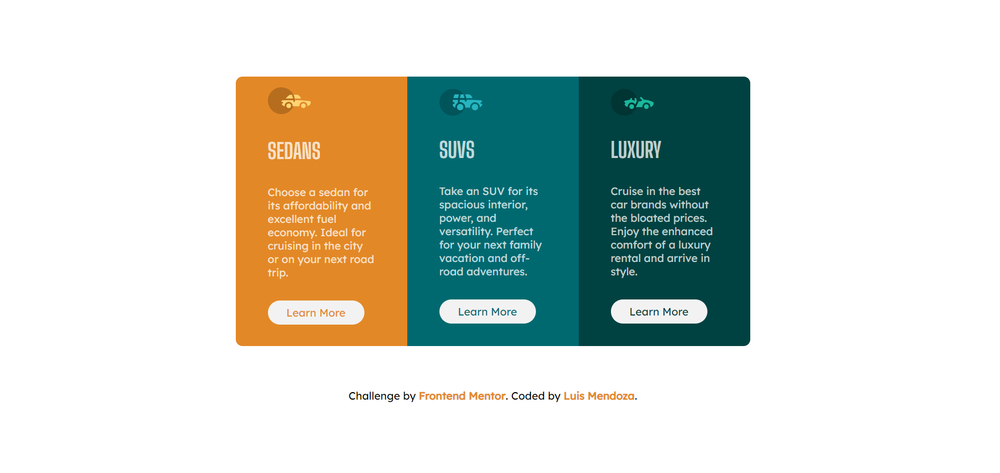

# Frontend Mentor - 3-column preview card component solution

This is a solution to the [3-column preview card component challenge on Frontend Mentor](https://www.frontendmentor.io/challenges/3column-preview-card-component-pH92eAR2-). Frontend Mentor challenges help you improve your coding skills by building realistic projects. 

## Table of contents

- [Overview](#overview)
  - [The challenge](#the-challenge)
  - [Screenshot](#screenshot)
  - [Links](#links)
- [My process](#my-process)
  - [Built with](#built-with)
  - [What I learned](#what-i-learned)
  - [Continued development](#continued-development)
  - [Useful resources](#useful-resources)
- [Author](#author)

## Overview

### The challenge

Users should be able to:

- View the optimal layout depending on their device's screen size
- See hover states for interactive elements

### Screenshot

### Links

- Solution URL: [Add solution URL here](https://your-solution-url.com)
- Live Site URL: [Add live site URL here](https://your-live-site-url.com)

## My process
I picked this challenge to practice layouts with css as I am still struggling with how to layout other projects and websites. I approached this by setting up the html first, trying to be more descriptive with the my class names so that it would help me when working on the css. Once I had that I attempted to do everything with only flex box and was running into a lot of issues. I then decided to brush up on css by taking Kevin Powell's Conquering Responsive Layouts course which really helped me approaching css. After taking this course I learned to breakdown how I tackled my css. I first worked on the colors and fonts and then focused on the layout portion. This really helped me break things down. After that I tackled the layout. 

### Built with

- Semantic HTML5 markup
- CSS custom properties
- Flex box
- CSS Grid
- Mobile-first workflow

### What I learned
I learned a lot by tackling this challenge,and took a whole course because I was frustrated when I couldn't figure it out before. I learned that I am good at getting the easier parts of css, like colors and fonts, since they're provided. I still struggled with the layout but after taking the KP's course when I tried different things but I had a bit more understanding of the things I attempted. Adding css grid helped tremendously as I had tried to stay away from it before because I didn't understand it before. I finally arrived at a solution I felt good about but I think it could still be better. If any one would like to take a look at my code and provide any feedback I would greatly appreciate it. Lastly I learned that I still have a long way to go with css but I do feel like I made some progress with this challenge.

### Continued development

Want to keep practicing layouts with flex box and css grid to keep getting better with each challenge.

### Useful resources

- [Kevin Powell's Conquering Responsive Layouts Course](https://courses.kevinpowell.co/)

  I could not figure this challenge out at first and I realized I needed more help on flex box and css grid. Actually took this course over a few days and then came back to this challenge approaching it with some of the things that I learned. Helped me tackle this mobile first and it helped.

## Author

- Frontend Mentor - [@Pike1868](https://www.frontendmentor.io/profile/Pike1868)
- Twitter - [@LuisMendozaio](https://twitter.com/LuisMendozaio)

